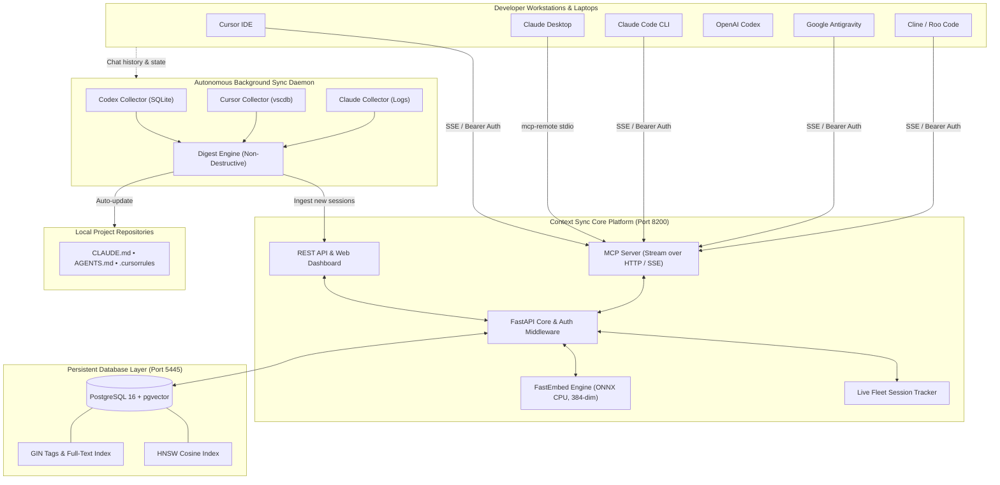

<div align="center">

# 🧠 Context Sync
### Universal Neural Memory & Context Synchronization Fabric for AI Coding Agents

[](https://github.com/your-org/context-sync/actions)
[](https://www.python.org/)
[](https://fastapi.tiangolo.com)
[](https://github.com/pgvector/pgvector)
[](https://modelcontextprotocol.io/)
[](https://www.docker.com/)
[](LICENSE)
[]()

**[English](README.md)** • **[Русский](README.ru.md)** • **[Architecture](docs/architecture.md)** • **[Agent Setup](docs/agents-setup.md)** • **[Auto-Sync](docs/auto-sync.md)** • **[API Reference](docs/api-reference.md)**

<p align="center">
  <b>Context Sync</b> unites fragmented AI coding assistants into a single, cohesive team.<br/>
  Cursor, Claude Desktop, Claude Code, OpenAI Codex, Antigravity, Windsurf, and Cline share a continuous neural knowledge base across all your machines.
</p>

---

</div>

## 🌟 Why Context Sync?

Modern software engineering involves multiple AI tools across several machines: **Cursor** on your desktop, **Claude Desktop** on your laptop, **OpenAI Codex CLI** on your build server, and **Claude Code** in your terminal. 

Today, these agents are **siloed and amnesic**:
- A bug analyzed and resolved in Cursor in the morning has to be re-explained to Claude Desktop in the afternoon.
- Architecture decisions made on your laptop never reach your home desktop.
- Multiple agents overwrite project rule files or work from stale assumptions.

**Context Sync fixes this permanently.** It provides a centralized, ultra-fast **Model Context Protocol (MCP)** memory server powered by **PostgreSQL 16 + pgvector** and **FastEmbed ONNX**, backed by an autonomous background sync daemon that extracts chat decisions and keeps `CLAUDE.md`, `AGENTS.md`, and `.cursorrules` updated with **zero manual prompts**.

---

## ⚡ Feature Matrix & Comparison

| Capability | Context Sync | Mem0 / Zep | Raw Vector DB (Chroma/Pinecone) | Single-Agent Memory |
|:---|:---:|:---:|:---:|:---:|
| **Native MCP Protocol (SSE + stdio)** | **✅ Native** | ❌ HTTP only | ❌ DB client only | ❌ Isolated |
| **Multi-Agent Fleet Support (8+ IDEs)** | **✅ Out of the box** | ⚠️ Custom code | ❌ Manual | ❌ Single tool |
| **Autonomous Background Chat Sync** | **✅ Continuous daemon** | ❌ Manual push | ❌ Manual push | ❌ Local only |
| **Automatic Project Context Injection** (`CLAUDE.md`, `.cursorrules`, `AGENTS.md`) | **✅ Non-destructive** | ❌ No | ❌ No | ⚠️ Static rules |
| **1-Click Agent Auto-Discovery & Injector** | **✅ Windows / macOS / Linux** | ❌ Manual | ❌ Manual | ❌ No |
| **Zero-Cost Local CPU Embeddings** | **✅ FastEmbed ONNX** | ⚠️ Paid API required | ⚠️ External API | ❌ No |
| **Real-time Live Fleet Web Dashboard** | **✅ Bilingual (EN / RU)** | ⚠️ Cloud UI | ⚠️ Raw DB admin | ❌ No |
| **Multi-Account Thread Resolution** | **✅ Supported (Codex)** | ❌ No | ❌ No | ❌ No |

---

## 🏛️ System Architecture



---

## 🤖 Supported AI Coding Agents

Context Sync includes built-in auto-discovery, 1-click configuration injection, and conversation history collectors:

| Agent / Editor | Transport | Config Path (Windows / macOS / Linux) | Status |
|:---|:---:|:---|:---:|
| **Claude Desktop** | `stdio` (`npx mcp-remote`) | `%APPDATA%\Claude\claude_desktop_config.json` | 🟢 Supported |
| **Claude Code CLI** | `SSE` | `~/.claude.json` | 🟢 Supported |
| **Cursor IDE** | `SSE` | `~/.cursor/mcp.json` | 🟢 Supported |
| **OpenAI Codex** | `TOML` | `~/.codex/config.toml` | 🟢 Supported |
| **Google Antigravity** | `SSE` | `~/.gemini/antigravity/mcp_config.json` | 🟢 Supported |
| **Windsurf IDE** | `SSE` | `~/.codeium/windsurf/mcp_config.json` | 🟢 Supported |
| **Cline (VS Code)** | `SSE` | `%APPDATA%\Code\User\...\cline_mcp_settings.json` | 🟢 Supported |
| **Roo Code (VS Code)** | `SSE` | `%APPDATA%\Code\User\...\cline_mcp_settings.json` | 🟢 Supported |

---

## 🚀 Quick Start in 60 Seconds

### 1. Launch with Docker Compose
Clone the repository and start the services:
```bash
git clone https://github.com/your-org/context-sync.git
cd context-sync

# Copy environment file
cp .env.example .env

# Start containers (Runs on non-conflicting ports 8200 & 5445)
docker compose up -d --build
```

The Web Dashboard is now live at **`http://localhost:8200`** (or `http://localhost:8000` if configured).

### 2. Auto-Connect All Local Agents
Run the auto-connect script:
- **Windows (PowerShell)**:
  ```powershell
  .\connect-agents.ps1
  ```
- **macOS / Linux**:
  ```bash
  python -m src.scanner --url http://localhost:8200/sse --token your-token
  ```
- **Or via Web UI**: Open `http://localhost:8200` ➔ Go to **"Fleet & Scanner"** ➔ Click **"Find & Connect Agents"**.

### 3. Launch Autonomous Auto-Sync Daemon
Keep project memory and `.cursorrules` / `CLAUDE.md` automatically synchronized across all running agents:
```powershell
.\start-auto-sync.ps1
```

---

## 🛠️ Model Context Protocol (MCP) Tools

Once connected, your AI agents have access to 5 native tools:

### 1. `context_search`
Perform high-speed hybrid vector and keyword search across your team memory:
```json
{
  "name": "context_search",
  "arguments": {
    "query": "How is PostgreSQL connection pooling configured?",
    "limit": 5,
    "project": "context_sync",
    "tags": ["database", "backend"]
  }
}
```

### 2. `context_save`
Save an architectural decision, solution, or bug investigation:
```json
{
  "name": "context_save",
  "arguments": {
    "title": "Port conflict resolution on remote deployment",
    "content": "Mapped Web UI to 8200 and PostgreSQL to 5445 to avoid Portainer collision.",
    "tags": ["docker", "devops"],
    "project": "context_sync"
  }
}
```

### 3. `context_get`
Retrieve a document by UUID.

### 4. `context_list`
List recent context documents with project, tag, or time filters.

### 5. `context_delete`
Safely remove outdated or superseded knowledge items.

---

## 🌐 Live Fleet & Web Dashboard

Open `http://localhost:8200` to access the real-time management dashboard:
- **Bilingual Interface**: Instant **EN / RU** toggle with zero page reloads.
- **Live Fleet Tracker**: See all active MCP sessions across your laptops, their IP addresses, user-agents, and last tool calls in real time.
- **Interactive Knowledge Explorer**: Semantic search with similarity score sliders, tag badges, and rich Markdown previews.
- **Context Editor**: Create, edit, and categorize memory entries with instant Markdown preview.
- **Auto-Sync Status**: Real-time inspection of active projects, sync intervals, and last cycle metrics.

---

## 💻 Remote Server Deployment

Context Sync is designed to run seamlessly on remote VPS or home lab servers (e.g. `10.10.10.11`):
- **Port Conflict Protection**: Default configuration uses port `8200` for the Web/MCP app and `5445` for PostgreSQL, ensuring no clashes with Portainer, standard PostgreSQL, or web servers.
- **Instant Deployment**:
  ```powershell
  .\deploy-remote.ps1 -RemoteHost "10.10.10.11" -RemoteUser "energetik" -AppPort 8200 -PostgresPort 5445
  ```
- **Rapid Development Sync**:
  ```powershell
  .\sync-to-remote.ps1
  ```

---

## 🧪 Testing & Verification

Context Sync maintains a comprehensive test suite covering FastEmbed vectors, MCP JSON-RPC handlers, fleet tracking, scanner injection, and auto-sync collectors:

```bash
python -m pytest tests/ -v
============================== 23 passed in 0.85s ==============================
```

---

## 🤝 Contributing

Contributions are warmly welcome! Please see **[CONTRIBUTING.md](CONTRIBUTING.md)** for detailed development guidelines, code standards, and PR workflows.

1. Fork the Project (`https://github.com/your-org/context-sync/fork`)
2. Create your Feature Branch (`git checkout -b feature/amazing-agent`)
3. Commit your Changes (`git commit -m 'feat: add adapter for NewAgent'`)
4. Push to the Branch (`git push origin feature/amazing-agent`)
5. Open a Pull Request

---

## 📄 License

Distributed under the **MIT License**. See **[LICENSE](LICENSE)** for more information.

<div align="center">
  <sub>Built with ❤️ by AI Engineers for the global agentic coding community.</sub>
</div>