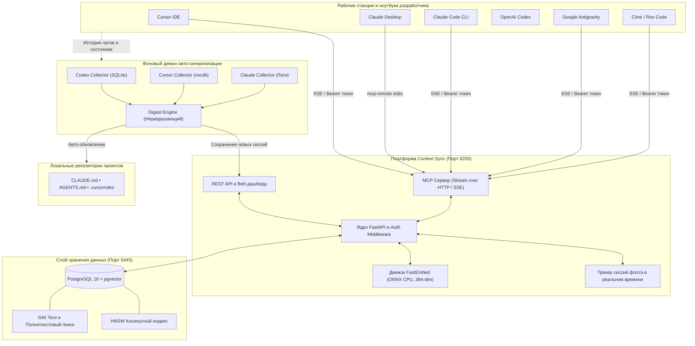

<div align="center">

# 🧠 Context Sync
### Универсальная нейронная память и платформа синхронизации контекста для ИИ-ассистентов и кодинг-агентов

[](https://github.com/your-org/context-sync/actions)
[](https://www.python.org/)
[](https://fastapi.tiangolo.com)
[](https://github.com/pgvector/pgvector)
[](https://modelcontextprotocol.io/)
[](https://www.docker.com/)
[](LICENSE)
[]()

**[English](README.md)** • **[Русский](README.ru.md)** • **[Архитектура](docs/architecture.md)** • **[Настройка агентов](docs/agents-setup.md)** • **[Авто-синхронизация](docs/auto-sync.md)** • **[Справочник API](docs/api-reference.md)**

<p align="center">
  <b>Context Sync</b> объединяет разрозненных ИИ-ассистентов в единую слаженную команду.<br/>
  Cursor, Claude Desktop, Claude Code, OpenAI Codex, Antigravity, Windsurf и Cline получают постоянную общую память на всех ваших устройствах.
</p>

---

</div>

## 🌟 Зачем нужен Context Sync?

В современной разработке используется сразу несколько ИИ-инструментов на разных машинах: **Cursor** на основном ПК, **Claude Desktop** на ноутбуке, **OpenAI Codex CLI** на сервере сборок и **Claude Code** в терминале.

Сегодня все эти агенты **изолированы и страдают амнезией**:
- Баг, разобранный и решенный утром в Cursor, приходится заново объяснять Claude Desktop днем.
- Архитектурные решения, принятые на рабочем ноутбуке, не доходят до домашнего компьютера.
- Несколько агентов переписывают проектные инструкции или действуют по устаревшим предположениям.

**Context Sync решает эту проблему навсегда.** Сервис предоставляет централизованное хранилище памяти по стандарту **Model Context Protocol (MCP)** на базе **PostgreSQL 16 + pgvector** и **FastEmbed ONNX**, дополненное автономным фоновым демоном, который собирает решения из чатов и обновляет файлы `CLAUDE.md`, `AGENTS.md` и `.cursorrules` **без ручных запросов**.

---

## ⚡ Матрица возможностей и сравнение

| Возможность | Context Sync | Mem0 / Zep | Обычная векторная БД (Chroma/Pinecone) | Локальная память агента |
|:---|:---:|:---:|:---:|:---:|
| **Нативный протокол MCP (SSE + stdio)** | **✅ Нативно** | ❌ Только HTTP | ❌ Только клиент БД | ❌ Изолировано |
| **Поддержка флота агентов (8+ IDE)** | **✅ Из коробки** | ⚠️ Требует кода | ❌ Вручную | ❌ Один инструмент |
| **Автономный фоновый синк чатов** | **✅ Непрерывный демон** | ❌ Ручная отправка | ❌ Ручная отправка | ❌ Только локально |
| **Авто-инъекция контекста в файлы** (`CLAUDE.md`, `.cursorrules`, `AGENTS.md`) | **✅ Неразрушающая** | ❌ Нет | ❌ Нет | ⚠️ Статичные правила |
| **Автосканер агентов в 1 клик** | **✅ Windows / macOS / Linux** | ❌ Вручную | ❌ Вручную | ❌ Нет |
| **Бесплатные эмбеддинги на CPU** | **✅ FastEmbed ONNX** | ⚠️ Платный API | ⚠️ Внешний API | ❌ Нет |
| **Интерактивный веб-дашборд флота** | **✅ Двуязычный (RU / EN)** | ⚠️ Облачный UI | ⚠️ Сырая консоль БД | ❌ Нет |
| **Поддержка нескольких аккаунтов (Codex)** | **✅ Поддерживается** | ❌ Нет | ❌ Нет | ❌ Нет |

---

## 🏛️ Архитектура системы



---

## 🤖 Поддерживаемые ИИ-агенты и IDE

Context Sync включает встроенное автосканирование, подключение в 1 клик и сборщики истории диалогов:

| Агент / IDE | Транспорт | Расположение конфига (Windows / macOS / Linux) | Статус |
|:---|:---:|:---|:---:|
| **Claude Desktop** | `stdio` (`npx mcp-remote`) | `%APPDATA%\Claude\claude_desktop_config.json` | 🟢 Поддерживается |
| **Claude Code CLI** | `SSE` | `~/.claude.json` | 🟢 Поддерживается |
| **Cursor IDE** | `SSE` | `~/.cursor/mcp.json` | 🟢 Поддерживается |
| **OpenAI Codex** | `TOML` | `~/.codex/config.toml` | 🟢 Поддерживается |
| **Google Antigravity** | `SSE` | `~/.gemini/antigravity/mcp_config.json` | 🟢 Поддерживается |
| **Windsurf IDE** | `SSE` | `~/.codeium/windsurf/mcp_config.json` | 🟢 Поддерживается |
| **Cline (VS Code)** | `SSE` | `%APPDATA%\Code\User\...\cline_mcp_settings.json` | 🟢 Поддерживается |
| **Roo Code (VS Code)** | `SSE` | `%APPDATA%\Code\User\...\cline_mcp_settings.json` | 🟢 Поддерживается |

---

## 🚀 Быстрый старт за 60 секунд

### 1. Запуск через Docker Compose
Склонируйте репозиторий и запустите контейнеры:
```bash
git clone https://github.com/your-org/context-sync.git
cd context-sync

# Создание конфигурационного файла
cp .env.example .env

# Запуск сервисов (порты 8200 и 5445 без конфликтов)
docker compose up -d --build
```

Веб-дашборд доступен по адресу **`http://localhost:8200`** (или `http://localhost:8000` в зависимости от `.env`).

### 2. Автоматическое подключение всех локальных агентов
Запустите скрипт автосканирования и внедрения MCP:
- **Windows (PowerShell)**:
  ```powershell
  .\connect-agents.ps1
  ```
- **macOS / Linux**:
  ```bash
  python -m src.scanner --url http://localhost:8200/sse --token your-token
  ```
- **Либо через Веб-интерфейс**: откройте `http://localhost:8200` ➔ раздел **«Флот и сканер»** ➔ нажмите **«Найти и подключить агентов»**.

### 3. Запуск автономного фонового демона
Для непрерывной автоматической синхронизации чатов и обновления `.cursorrules` / `CLAUDE.md`:
```powershell
.\start-auto-sync.ps1
```

---

## 🛠️ Инструменты Model Context Protocol (MCP)

После подключения агентам доступны 5 нативных инструментов:

### 1. `context_search`
Высокоскоростной гибридный семантический и ключевой поиск по корпоративной памяти:
```json
{
  "name": "context_search",
  "arguments": {
    "query": "Как настроен пул соединений в PostgreSQL?",
    "limit": 5,
    "project": "context_sync",
    "tags": ["database", "backend"]
  }
}
```

### 2. `context_save`
Сохранение архитектурного решения, найденного багфикса или стандарта:
```json
{
  "name": "context_save",
  "arguments": {
    "title": "Устранение конфликта портов на сервере 10.10.10.11",
    "content": "Веб-интерфейс перенесен на 8200, база на 5445 во избежание коллизии с Portainer.",
    "tags": ["docker", "devops"],
    "project": "context_sync"
  }
}
```

### 3. `context_get`
Получение полного текста документа по UUID.

### 4. `context_list`
Список недавних записей с фильтрацией по проекту, тегам или дате.

### 5. `context_delete`
Удаление устаревших контекстных записей.

---

## 🌐 Веб-дашборд и мониторинг флота

Откройте `http://localhost:8200` для доступа к панели управления:
- **Мгновенное переключение языка (RU / EN)** без перезагрузки страниц.
- **Живой монитор флота (Live Fleet)**: список всех активных MCP-сессий со всех компьютеров с IP-адресами, user-agent и последними вызовами инструментов в реальном времени.
- **Интерактивный поиск**: семантический поиск со шкалой релевантности, тегами и подсветкой синтаксиса.
- **Редактор контекста**: создание и редактирование записей с живым Markdown-предпросмотром.
- **Мониторинг авто-синка**: статус локальных проектов, интервалы и статистика циклов.

---

## 💻 Развертывание на удаленном сервере (VPS)

Context Sync оптимизирован для развертывания на выделенном сервере или домашнем сервере (например, `10.10.10.11`):
- **Защита от конфликта портов**: по умолчанию проект использует порт `8200` для приложения и `5445` для PostgreSQL, исключая пересечение с Portainer (8000) или стандартным Postgres (5432).
- **Скрипт развертывания**:
  ```powershell
  .\deploy-remote.ps1 -RemoteHost "10.10.10.11" -RemoteUser "energetik" -AppPort 8200 -PostgresPort 5445
  ```
- **Синхронизация локальных правок без пересборки**:
  ```powershell
  .\sync-to-remote.ps1
  ```

---

## 🧪 Тестирование и надежность

В репозиторий включен полный тестовый набор (векторные вычисления FastEmbed, обработчики JSON-RPC, трекер флота, инъектор сканера и коллекторы демона):

```bash
python -m pytest tests/ -v
============================== 23 passed in 0.85s ==============================
```

---

## 🤝 Участие в разработке

Мы приветствуем вклад сообщества! Ознакомьтесь с **[CONTRIBUTING.md](CONTRIBUTING.md)** для руководства по код-стайлу, тестам и PR.

1. Форкните репозиторий (`https://github.com/your-org/context-sync/fork`)
2. Создайте ветку (`git checkout -b feature/new-cool-agent`)
3. Закоммитьте изменения (`git commit -m 'feat: add adapter for NewCoolAgent'`)
4. Отправьте в ветку (`git push origin feature/new-cool-agent`)
5. Откройте Pull Request

---

## 📄 Лицензия

Распространяется под лицензией **MIT**. Подробности в файле **[LICENSE](LICENSE)**.

<div align="center">
  <sub>Создано с ❤️ сообществом ИИ-инженеров для автономного кодинга будущего.</sub>
</div>